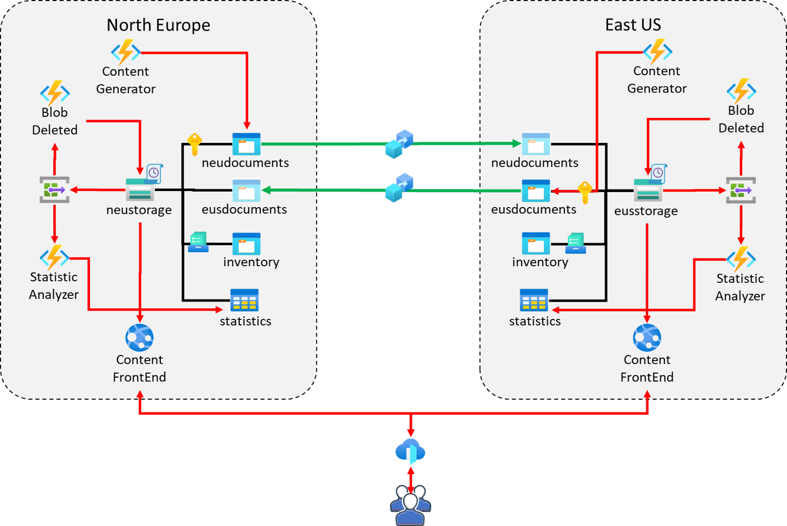

# Storage Content Platform
This is a demo for a simple multi-region solution to distribute static content using Storage Account.

## Demo requirements
The solution implements these requirements:

* the platform produces an average of 100 Mb of new contents every hour in two different locations;
* contents are frequently accessed in the first 10 days, very rarely after a month, and can be deleted after 1 year;
* contents cannot be deleted for 10 days after publication;
* the maximum downtime in a single month must be under 5 minutes;
* the costs must be kept to a minimum;
* the platform needs daily statistics on the number of contents available, and on the space occupied;

## Architecture
The following image describes the solution architecture:

### Solution components
Every region is composed of:
- `App Service` : this is the front-end application. It retrieves static contents (in the demo the contents are simple text blob) from a storage in the same region. The C# project for this component is [here](StorageContentPlatform.Web/README.md);
- `Storage Account` : the storage account contains all the static contents (text blobs). The contents are generated locally or are synchronized from remote repository using Storage Account Object replication (<a href="https://learn.microsoft.com/en-us/azure/storage/blobs/object-replication-overview" target="_blank">documentation</a>).
- `Content Generator` (Azure Function) : this Azure Function generates contents every hour. The project of the function is [here](StorageContentPlatform.ContentCreator/README.md).
- `Static Analyzer` (Azure Function) : this azure Function parses the inventory file generated by the storage account every day to fille the statistics in a table storage. The project for this component is [here](StorageContentPlatform.ManagementFunctions/README.md).
- `Event Grid` : it is used to manage the [BlobInventoryPolicyCompleted event](https://learn.microsoft.com/en-us/azure/event-grid/event-schema-blob-storage?toc=%2Fazure%2Fstorage%2Fblobs%2Ftoc.json&tabs=event-grid-event-schema#microsoftstorageblobinventorypolicycompleted-event) event generated by the Storage Account every time it completes a new inventory. The event allows the platform to parse the inventory file as soon as it is created spending the minimum.

The solution use a FrontDoor service to balance traffic between the two regions.
